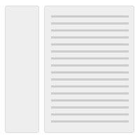
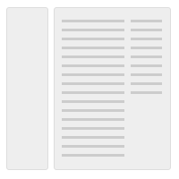

<h3>Layouts</h3>

#### Purpose

Consistent and predictable layouts allow users to navigate and understand applications easier. 

#### Description

These layout and content types cover most use-cases for standard web pages. Web applications often have more complex needs, but should still be able to follow similar styles and layouts. 

#### Layout types

There are three types of layouts.

##### Fixed

[View example](layouts/fixed.html){:target="_blank"}

The fixed width page layout deliberately constrains the overall width of the content and horizontally centers it on the page. This gives the designer more control and can be useful for when a more predictable layout with easy to read line lengths are needed. Conversely, it constrains the amount of space available to content and takes away control over presentation from the user.
{: .clearfix}

##### Fluid

[View example](layouts/fluid.html){:target="_blank"}

The fluid page layout provides maximum space for content in all sizes, and leaves control over the size of the UI to the user by automatically adjusting to fit the size of their browser. An issue to be aware of is that some types of content (like large bodies of text) can become hard to read due to excessively long line lengths if nothing is done to mitigate this. 
{: .clearfix}

##### Hybrid

[View example](layouts/hybrid.html){:target="_blank"}

The hybrid page layout combines the fluid design for the application header with a fixed width design for the rest of the content area. It should only be used in cases where a fixed width page layout is desirable but where the Application header might contain a large number of items.
{: .clearfix}

#### Content types

These content types are used within fixed, fluid, or hybrid layouts.

##### Content only

[View example](layouts/type-content-only.html){:target="_blank"}

The content only layout maximizes the space available for content. It provides more horizontal space than the other layouts, and is therefore ideal for displaying wide tables and other large user interface elements. Conversely, it doesn't provide any structure for grouping and separating elements.
{: .clearfix}

##### Navigation and content

[View example](layouts/type-content-navigation.html){:target="_blank"}

The navigation and content layout has a column for vertical navigation to the left of the content area, which is useful for when a long list of navigation links is necessary. See Vertical navigation and Horizontal navigation for more detail.
{: .clearfix}

##### Content with right sidebar

[View example](layouts/type-content-sidebar.html){:target="_blank"}

The content and sidebar layout has a column to the right of the content area. The sidebar is used for supplementary content, which would otherwise interrupt the flow of content in the main content area.
{: .clearfix}

##### Navigation and content with right sidebar

[View example](layouts/type-navigation-content-sidebar.html){:target="_blank"}

The navigation, content and sidebar layout is a combination of the three layouts mentioned above. This layout can be used when a vertical navigation is required as well as a two column structure in the content area.
{: .clearfix}

##### Focused task

[View example](layouts/type-focused.html){:target="_blank"}

The focused task layout has a smaller, fixed width content area that is horizontally centered on the page regardless of which layout type is used.
{: .clearfix}

{::nomarkdown}

    

{:/nomarkdown}

